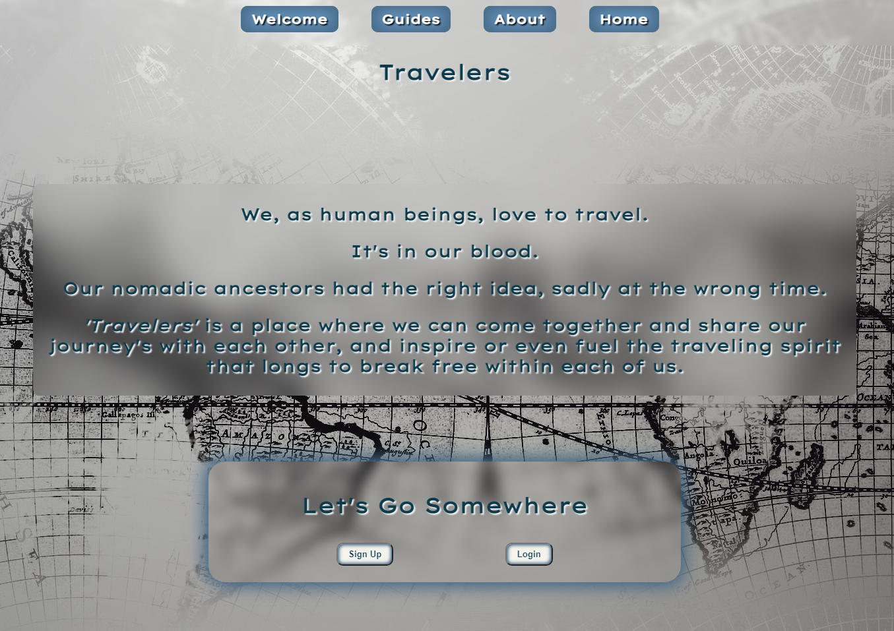
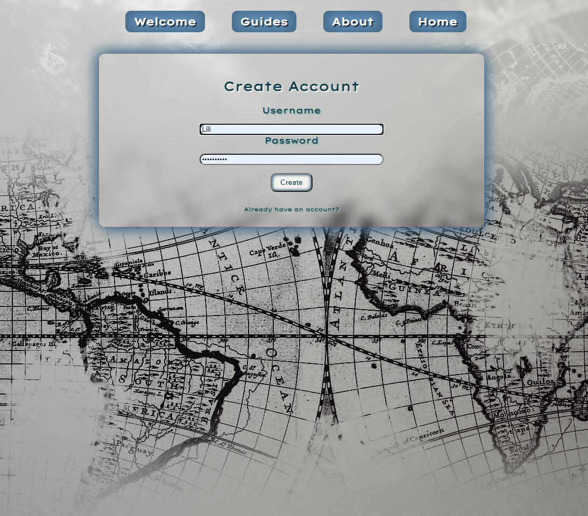
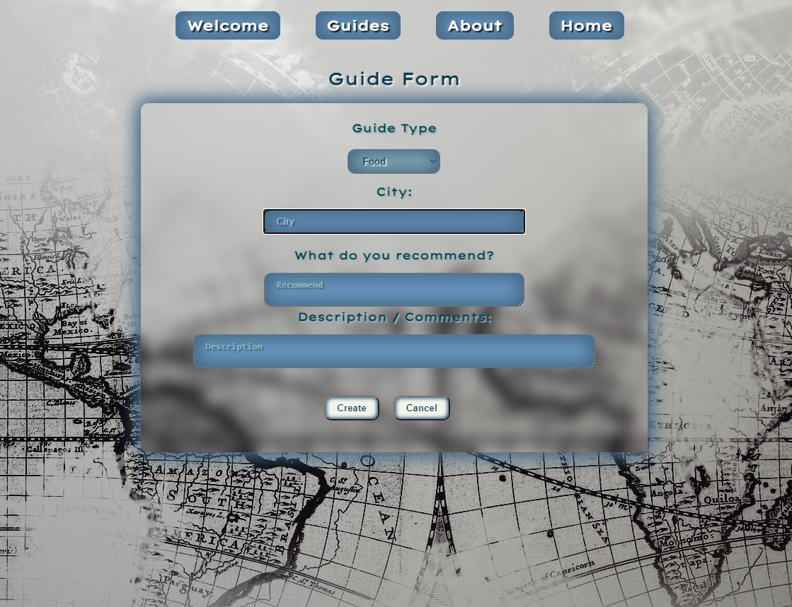
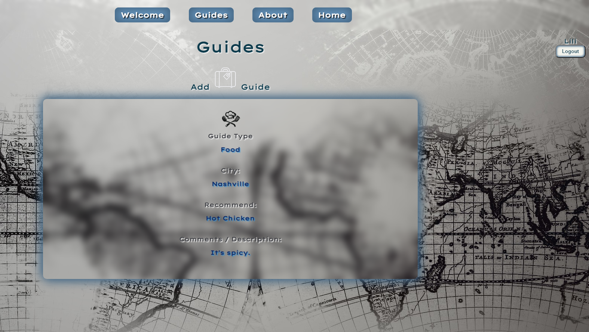

# Travelers

## [Travelers](https://Travelers.vercel.app)

## Description

Whether you want to plan your own trip or live vicariously through others and their shared travel stories, let Traveler help!

Upon registering and logging in, the user will be taken to the homepage where they will see all the guides posted by other users, as well as their own guide. These guides are listed from the most recent to the oldest. Upon submitting a guide, the user will be redirected to the guides page where they will see all guides submitted. A user may edit and also delete their own guide, but not the ones of other users. The edit and delete buttons are conditionally rendered to show when the guide user id matches the id of the user who is logged in.

If the user tries to navigate to a route or guide that does not exist, they will be rerouted to a 404 page.

Travelers is a PERN application, using PostgreSQL, Express, React and Node.js.

Link to backend GH : [Travelers API](https://github.com/LFuen/travelers-API)
